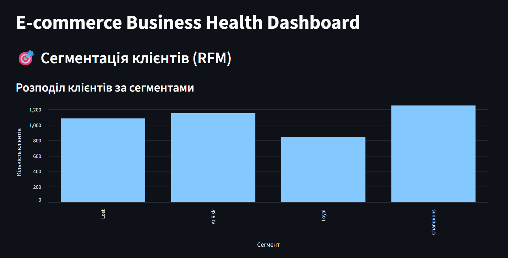

Markdown
# E-Commerce Customer Analytics & RFM Segmentation Dashboard

An end-to-end data analytics and business intelligence project that transforms raw e-commerce transactional data into an interactive Python-based web dashboard for monitoring key product metrics and customer behavior.

## Dashboard Preview



---

## Objective

To provide product managers and marketing teams with data-driven insights into business health, customer retention dynamics, and behavior-based customer segmentation (RFM) to optimize marketing campaigns and reduce churn.

---

## Tech Stack

| Tool / Library | Usage |
|---|---|
| **Python 3.x** | Core programming language |
| **Pandas** | Data cleaning, ETL, and complex metric calculations |
| **Streamlit** | Interactive frontend and web dashboard framework |
| **Matplotlib & Seaborn** | Data visualization (Kogort Heatmaps) |

---

## Metrics & Segmentation Model

### **1. Business Health & Product Metrics**
- **MAU (Monthly Active Users)** — Number of unique active customers per month.
- **AOV (Average Order Value)** — Total monthly revenue divided by the number of unique orders.
- **Retention Rate (Cohort Analysis)** — Percentage of customers from a specific cohort who return to make a purchase in subsequent months.

### **2. RFM Segmentation Model**
Customers are scored from 1 to 5 across three core behavioral metrics:
- **Recency (R)** — Days elapsed since the customer's last purchase (calculated relative to a global database `snapshot_date`).
- **Frequency (F)** — Total number of unique orders placed by the customer.
- **Monetary (M)** — Total lifetime spending of the customer.

Based on the cumulative **RFM Score**, customers are automatically grouped into **4 actionable business segments**:
-  **Champions (Score 12-15):** High-value VIP buyers who purchase frequently and recently.
-  **Loyal (Score 9-11):** Steady customers with high engagement and lifetime value.
-  **At Risk (Score 6-8):** Previously active or high-spending customers who haven't purchased in a while.
-  **Lost (Score 3-5):** Inactive customers who made a small one-time purchase long ago.

---

##  Key Features & Technical Implementations

- **Modular Architecture:** The project separates core analytical calculations (`metrics_calculator.py`, `rfm_analyzer.py`) from the user interface presentation layer (`app.py`).
- **Advanced Quantile Binning:** Utilized `pd.qcut()` for programmatic, balanced user grading based on statistical distributions.
- **Interactive Marketing Filter:** Integrated dynamic data previewing and custom targeted CSV exports inside Streamlit for specific customer segments (e.g., extracting the "At Risk" list for re-engagement campaigns).
- **Performance Optimization:** Implemented `@st.cache_data` caching mechanisms to optimize dataset memory-loading and prevent re-running heavy analytical calculations on user clicks.

---

##  Repository Structure

ecommerce-analytics-dashboard/
│
├── data/
│   └── online_retail_clean.csv   # Cleaned transactional dataset
│
├── metrics_calculator.py     # Calculations for MAU, AOV, and Cohort Retention
└── rfm_analyzer.py           # Core RFM calculation and scoring model
└── app.py                        # Streamlit web application interface
└── README.md                     # Project documentation


---

##  How to Run the App Locally

1. Clone this repository:
   ```bash
   git clone [https://github.com/MelloWingg/E-commerce-Business-Health-Dashboard](https://github.com/MelloWingg/E-commerce-Business-Health-Dashboard)
   cd ecommerce-analytics-dashboard
Install required dependencies:

Bash
pip install streamlit pandas matplotlib seaborn
Run the Streamlit application:

Bash
streamlit run app.py
👤 Author
Danylo Demchuk
[LinkedIn](https://linkedin.com/in/in/danylo-demchuk-da) · [GitHub](https://github.com/MelloWingg) 
